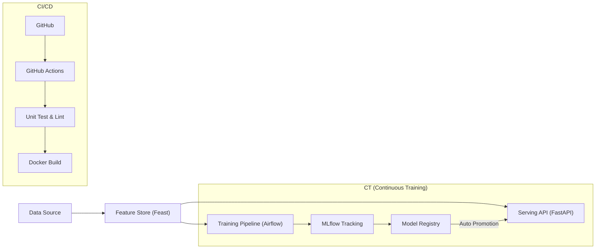

# 🌿 Green Fraud Detection MLOps Pipeline

"친환경 금융 사기 탐지 시스템"을 위한 End-to-End MLOps 파이프라인 구축 프로젝트입니다.
데이터 전처리부터 모델 학습, 배포, 그리고 지속적 학습(CT)까지의 전 과정을 자동화하였으며, 탄소 배출량을 모니터링하여 친환경 AI를 지향합니다.

## 🚀 Project Architecture

이 프로젝트는 **MLOps Maturity Model Level 2+** (Automated Pipeline)를 달성하는 것을 목표로 합니다.



## 🛠️ Tech Stack

- **Model**: PyTorch (Baseline, Light, Heavy Models)
- **Orchestration**: Apache Airflow
- **Experiment Tracking**: MLflow
- **Feature Store**: Feast
- **Serving**: FastAPI, Docker
- **CI/CD**: GitHub Actions
- **Green AI**: CodeCarbon (Carbon Emission Tracking)

---

## 📂 Project Structure

```bash
├── .github/workflows   # CI Pipeline (GitHub Actions)
├── dags/               # Airflow DAGs (CT Pipeline)
├── docker/             # Docker Configuration
├── feature_repo/       # Feast Feature Store Config
├── src/
│   ├── data/           # Data Loader & Preprocessing
│   ├── models/         # Model Definitions & Training
│   ├── serving/        # FastAPI Server & Model Registry
│   └── visualization/  # Dashboard & Plots
├── tests/              # Unit Tests
└── requirements.txt    # Dependencies
```

---

## ⚡ Quick Start

### 1. Local Setup
```bash
# 1. Install Dependencies
pip install -r requirements.txt

# 2. Run Unit Tests
pytest tests/

# 3. Run API Server
python -m uvicorn src.serving.api:app --reload
```

### 2. Docker Setup (Recommended)
```bash
# Build and Run API Server
docker-compose -f docker/docker-compose.yml up -d --build api-server

# Check Health
curl http://localhost:8000/health
```

---

## 🔄 MLOps Pipeline Details

### Phase 1: CI (Continuous Integration)
- **Tools**: GitHub Actions, Flake8, Pytest
- **Workflow**:
    - 코드가 Push되면 자동으로 Lint 검사 및 Unit Test 수행
    - 코드 품질과 기능 무결성을 보장

### Phase 2: CD (Continuous Deployment)
- **Tools**: Docker, FastAPI
- **Workflow**:
    - 학습된 모델을 REST API로 서빙
    - Docker 컨테이너화를 통해 환경 일관성 보장
    - CPU 최적화된 Dockerfile로 빌드 효율성 증대

### Phase 3: CT (Continuous Training)
- **Tools**: Airflow, MLflow
- **Workflow**:
    - `fraud_detection_pipeline` DAG가 주기적으로 실행
    - 데이터 청크(Chunk) 단위로 Incremental Learning 수행
    - **Auto-Promotion**: 학습된 모델이 기존 모델보다 성능이 좋으면 자동으로 `Production` 단계로 승격
    - API 서버는 `Production` 모델을 동적으로 로드 (Hot Reload)

### Phase 4: Feature Store
- **Tools**: Feast
- **Workflow**:
    - **Training-Serving Skew** 해결
    - `feature_repo`에서 피처 정의 및 관리
    - Offline Store(Parquet) -> Online Store(SQLite/Redis)로 데이터 동기화
    - API 서버에서 실시간으로 일관된 피처 조회

---

## 🌱 Green AI Initiative
- **CodeCarbon**을 사용하여 학습 및 추론 과정에서 발생하는 탄소 배출량을 추적합니다.
- `logs/emissions.csv`에 기록되며, 대시보드를 통해 시각화할 수 있습니다.

---

## 📝 License
This project is licensed under the MIT License.
